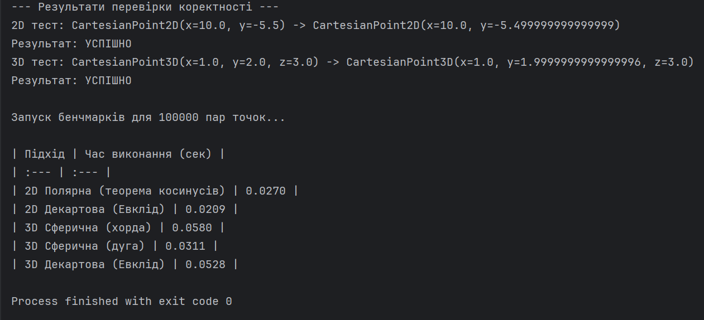

# Лабораторна робота №1: Програмні моделі систем координат
# Панченко Даниїл, ІПЗ-4.01

## Короткий опис роботи
Метою лабораторної роботи є проектування та реалізація імутабельних (незмінних) програмних моделей для представлення точок у 2D та 3D просторах. 
У рамках проекту було реалізовано:
* `CartesianPoint2D` та `CartesianPoint3D` для декартової системи.
* `PolarPoint` для двовимірної полярної системи.
* `SphericalPoint` для тривимірної сферичної системи.

Перетворення між системами координат реалізовано за допомогою статичних фабричних методів. Також були розроблені функції для обчислення відстаней між точками безпосередньо у відповідних системах координат без попередньої конвертації.

---

## Інструкції для запуску проекту
Для успішної компіляції та запуску проекту дотримуйтесь наступних кроків:

1. **Вимоги до середовища:** На комп'ютері має бути встановлений **Python версії 3.7** або вище (оскільки використовується модуль `dataclasses` та анотації типів `from __future__ import annotations`).
2. **Залежності:** Проект використовує виключно стандартні бібліотеки Python (`math`, `time`, `random`, `dataclasses`, `typing`). Встановлення сторонніх пакетів через `pip` не вимагається.
3. **Запуск:** * Відкрийте термінал у папці з файлом проекту (наприклад, `Lab#1.py`).
   * Виконайте команду: `python "Lab#1.py"`

---

## Результати перевірки коректності
Пряме та зворотне перетворення координат між системами працює коректно. Початкові координати повністю збігаються з кінцевими після подвійної конвертації (з урахуванням мінімальної допустимої похибки обчислень чисел з рухомою комою). 

Скриншот успішного проходження тестів та запуску бенчмарків:

---

## Результати аналізу продуктивності (Бенчмаркінг)
Нижче наведено таблицю з результатами вимірювання чистого часу виконання розрахунку відстаней для масивів з 100 000 пар точок:

| Підхід | Час виконання (сек) |
| :--- | :--- |
| **2D Полярна** (теорема косинусів) | 0.0270 |
| **2D Декартова** (Евклід) | 0.0209 |
| **3D Сферична** (пряма хорда) | 0.0580 |
| **3D Сферична** (дугова відстань) | 0.0311 |
| **3D Декартова** (Евклід) | 0.0528 |

### Аналіз та висновки 

**Для 2D:**
Як видно з результатів, розрахунок евклідової відстані у Декартовій системі (0.0209 с) є швидшим за розрахунок у Полярній системі (0.0270 с). Це пояснюється тим, що формула для декартових координат спирається на прості арифметичні операції (віднімання, піднесення до квадрата) та один виклик `math.sqrt()`. Натомість обчислення за теоремою косинусів вимагає виклику тригонометричної функції `math.cos()`, яка обчислювально є значно "важчою" та повільнішою для процесора.

**Для 3D:**
У тривимірному просторі результати виявилися дуже цікавими. Найшвидшим методом став розрахунок дугової відстані на сфері (0.0311 с), а найповільнішим — розрахунок прямої відстані (хорди) через сферичні координати (0.0580 с). 
Розрахунок хорди потребує найбільшої кількості операцій (4 виклики тригонометрії + корінь `math.sqrt`). Декартова формула (0.0528 с) показала середній результат, оскільки вимагає 3 віднімання, 3 піднесення до квадрата та виклик квадратного кореня. Найвища швидкість дугової відстані пояснюється відсутністю операції здобуття квадратного кореня (`sqrt`) та ефективною реалізацією функції `math.acos()` на рівні мови С (під капотом Python).

---

## Загальний висновок
Під час виконання лабораторної роботи було успішно закріплено навички роботи з об'єктно-орієнтованим програмуванням, зокрема проектування імутабельних структур даних за допомогою патерну Static Factory Method. Головним інсайтом бенчмаркінгу стало розуміння того, що вибір математичної моделі критично впливає на швидкодію програми: наявність складних тригонометричних функцій або операцій добування кореня може суттєво уповільнити виконання коду на великих масивах даних.
